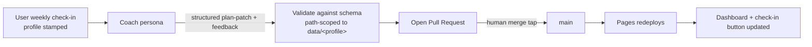

# PerformanceOS — Architecture & Build Plan

Status: **living document.** This captures the agreed design for turning the
single-user dashboard into a **multi-profile, coach-in-the-loop** training
platform. Any Claude Code / Cowork / fresh session should read this first to be
current.

---

## 1. What this is

A **Garmin dashboard** that renders your data into easy-to-read displays with
**integrated coaching plans** built in. The plans are live: each user follows the
training plan their coach has set out, with the ability to provide **weekly
updates through a check-in**. From that check-in, the coach amends any future
training sessions to match how the user is feeling and the feedback they
provided — if a change is applicable.

It runs entirely on **GitHub Pages + GitHub Actions** — no server, no database.

---

## 2. Current architecture (single-user, today)

```
Garmin Connect ──(daily GitHub Action, token auth)──> data/garmin.json ──> dashboard reads it
User ──(Weekly check-in button)──> Claude (deep link, pre-filled with live data)
```

- `index.html`, `styles.css`, `app.js` — the dashboard. `app.js` currently
  builds the training schedule **in code** (fixtures); the plan is not yet data.
- `data/garmin.json` — live metrics, written by the sync workflow.
- `scripts/fetch_garmin.py` + `.github/workflows/garmin-sync.yml` — the inbound
  sync (token-only auth via `GARMINTOKENS` secret).
- Weekly check-in button deep-links to `claude.ai/new?q=…`, pre-filled from live
  data. One-way today.

---

## 3. Target architecture (multi-profile, coach-in-the-loop)

### 3.1 Profiles

Each person is a **profile** with its own namespaced data folder. Isolation is
enforced by **path scoping in code**, never by model judgement.

```
data/
  profiles.json            # registry: who exists, display name, coach persona, dashboard type
  cjf/                     # Callum (endurance-performance)
    garmin.json
    plan.json
    profile.json
  jj/                      # Jamie "JJ" (prenatal)
    garmin.json
    plan.json
    profile.json
```

- `profiles.json` — registry, e.g.:
  ```json
  {
    "default": "cjf",
    "profiles": {
      "cjf": { "name": "Callum", "persona": "endurance-performance", "dashboard": "performance" },
      "jj":  { "name": "JJ",     "persona": "prenatal",              "dashboard": "prenatal" }
    }
  }
  ```
- `profile.json` (per person) — goals, paces, preferences, and persona-specific
  state (for JJ: pregnancy stage + `clearedByProvider` flag).

### 3.2 URL routing

One site, profile chosen by query param:
- `https://<host>/fitfish/?u=cjf` (default if omitted)
- `https://<host>/fitfish/?u=jj`

The dashboard reads only `data/<profile>/…` for the selected profile.

### 3.3 Coach personas (per profile)

Same engine, **swappable coach persona** selected by the profile. Pregnancy is
the first case proving why per-profile personas is the right abstraction — it
*inverts* the coaching goal.

| Persona | Goal | Dashboard emphasis |
|---|---|---|
| `endurance-performance` (Callum) | Get faster, sharpen for race | VO₂, threshold, projected 10k, PBs, load |
| `prenatal` (JJ) | Maintain safely, adapt by stage, monitor symptoms | RPE / talk-test, readiness, gentle volume — **no PB/pace/predictor** |

### 3.4 Prenatal persona — safety guardrails (non-negotiable)

The prenatal dashboard and coach **must**:
1. Carry a prominent **"not medical advice"** disclaimer.
2. Gate any progression behind **`clearedByProvider: true`** — advise getting
   OB/GYN or midwife clearance first; stay conservative until then.
3. Be **RPE / talk-test based**, not pace/HR-max/PB targets.
4. Surface **warning signs** to stop and seek care (bleeding, contractions,
   fluid leakage, chest pain, dizziness, calf pain/swelling, reduced fetal
   movement, etc.) and always escalate to her provider, never to the tool.
5. Be grounded in recognised guidance (e.g. ACOG / national physical-activity
   -in-pregnancy guidelines), trimester-aware (supine limits, fall/contact
   avoidance, overheating), and expect volume/intensity to trend **down**.
6. Emit **proposals only** — plan changes are PR-reviewed, never auto-merged,
   and framed as "discuss with your provider."

> Hard boundary by design: this is **not a medical device**. Provider oversight
> is essential and the tool never replaces it.

---

## 4. Data flow

### 4.1 Inbound — Garmin sync (profile-aware)

```mermaid
flowchart LR
  A[Garmin Connect] -->|token per profile| B[garmin-sync Action]
  B --> C[data/cjf/garmin.json]
  B --> D[data/jj/garmin.json]
  C --> E[Dashboard ?u=cjf]
  D --> F[Dashboard ?u=jj]
```



The sync workflow loops over profiles; each profile has its **own token secret**
(`GARMINTOKENS_CJF`, `GARMINTOKENS_JJ`) and writes only its own folder.

### 4.2 Outbound — coach check-in loop



**Isolation guarantee:** the check-in carries a `profile` id; the apply step
computes the target path *from that id* and can only write
`data/<profile>/plan.json`. A JJ check-in physically cannot touch `cjf/` files.
The PR diff makes any scope violation visible before merge.

---

## 5. The coach loop — two build layers

- **6a Deterministic apply pipeline** ✅ **built**: `scripts/apply_plan_patch.py`
  validates a `plan-patch` and applies it **path-scoped** to one profile's
  `plan.json`; the `Apply coach patch` workflow (`workflow_dispatch`) runs it and
  opens a PR for your merge tap. Guarded by `scripts/test_isolation.py` in CI.
- **6b Autonomous coach** (needs a decision): the "hands" that produce the patch
  unattended. Options, most→least reliable for GitHub write:
  - **Claude Code headless in a GitHub Action** — real git access; needs Claude
    credentials as a secret (API key or Claude Code OAuth token). *(penciled in.)*
  - **Cowork scheduled Routine** — account-based agent against the repo.
  - **claude.ai Project + GitHub connector** — write scope **unconfirmed**; not
    relied upon.

Structured `plan-patch` contract (enforced by `apply_plan_patch.py`):
```json
{
  "profile": "cjf",
  "week": 8,
  "coachNote": "human-readable feedback",
  "changes": [
    { "day": "Wed", "op": "replace", "index": 1,
      "session": {"kind":"easy","title":"Easy 40'","target":"Conversational","comp":"none"} },
    { "day": "Sat", "op": "add",
      "session": {"kind":"mobility","title":"Mobility 20'","target":"Gentle","comp":"none"} },
    { "day": "Tue", "op": "remove", "index": 0 }
  ]
}
```
`op` ∈ `replace` | `add` | `remove`. The applier rejects unknown profiles,
path-escaping ids, out-of-range weeks/indices, invalid days and malformed
sessions — writing nothing on any failure.

---

## 6. Security & privacy

- **Repo is public** (user's decision). Both `data/cjf/` and `data/jj/` are
  publicly readable. JJ is a **pseudonym** for light anonymisation — reduces but
  does not remove exposure; pregnancy status is still public and could be
  correlated. On the record, accepted by the user.
- **Auth is token-only** per profile (`GARMINTOKENS_*` secrets). No Garmin
  email/password is ever stored in GitHub. Secrets are encrypted and not
  readable even in a public repo.
- **Lucide CDN script** is pinned with Subresource Integrity.
- If **6b** uses the Anthropic API, the key is a GitHub secret; per-run cost
  applies. Autonomous plan changes stay **PR-gated** (never auto-merged),
  especially for the prenatal profile.

---

## 7. Build order (this phase)

1. ✅ **This doc.**
2. ✅ **Profile foundation + routing + migrate existing data** — `profiles.json`,
   `data/cjf/` + `data/jj/`, URL profile select (`?u=`), `data/garmin.json` →
   `data/cjf/garmin.json`.
3. ✅ **Profile-aware Garmin sync** — workflow loops profiles, per-profile token
   secret, own folder; daily job stays alive.
4. ✅ **Plan-as-data refactor** — `data/<profile>/plan.json`, dashboard renders the
   plan from it (fixture fallback); verified byte-identical across 17 weeks.
5. ✅ **JJ prenatal dashboard + persona + guardrails** — dropped PB/pace/predictor,
   added disclaimer + provider-clearance gate + warning signs; prenatal coach prompt.
6. **Coach loop** — 6a ✅ deterministic patch→PR pipeline (`apply_plan_patch.py`
   + `Apply coach patch` workflow); **6b** wire the autonomous runner (pending
   runner decision + secret).
7. ✅ **Isolation test** — `test_isolation.py` proves cross-over isolation +
   validation; runs in CI (`tests.yml`).

Each step is verified continuously (desktop + mobile), not only at step 7.

---

## 8. Open decisions & known limits

- **6b runner not chosen** — Claude Code vs Cowork vs API. Everything up to and
  including 6a can be built without it.
- **Prenatal medical accuracy** — guideline-grounded + disclaimered, but not a
  medical device; provider oversight required. Deliberate boundary.
- **Project connector write** — unconfirmed; not on the critical path.
- **Vanity URL** — `?u=jj` today. A true `/jj/` path is possible with a little
  more setup if wanted.
- **Scaling to strangers ("Road B")** — would require a real backend, auth, a
  database, and an *official* data source (Strava OAuth / Garmin dev program).
  Out of scope for this phase; the frontend carries over if pursued.
